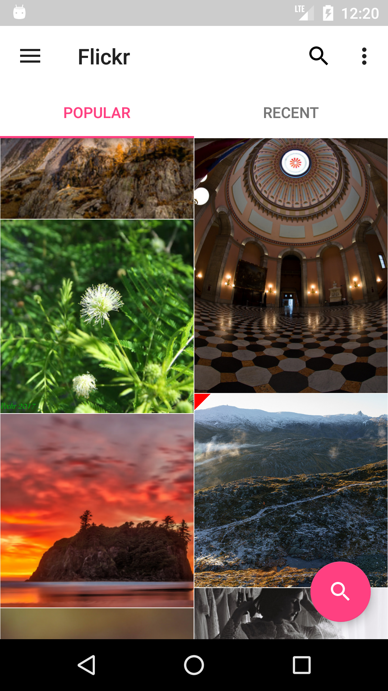
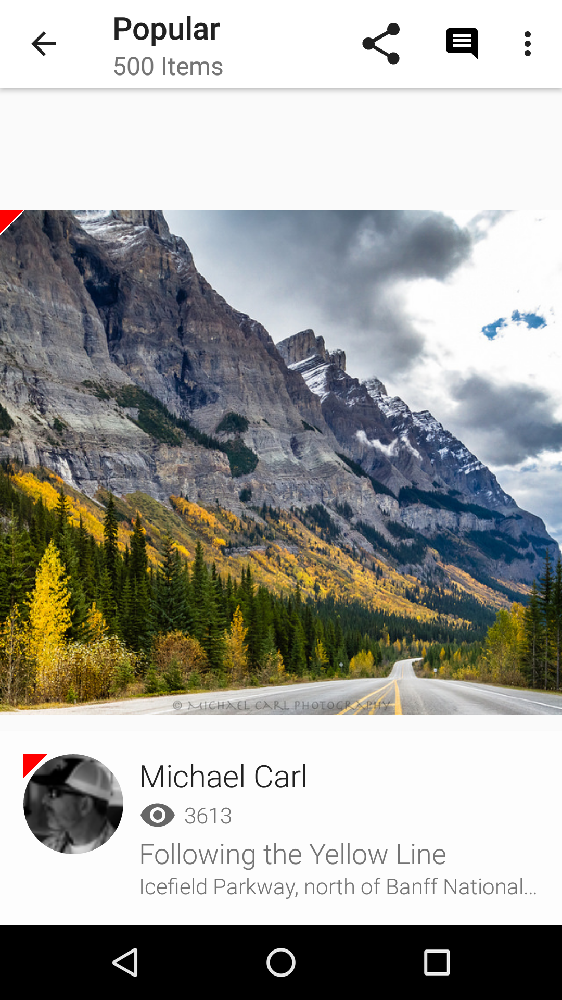
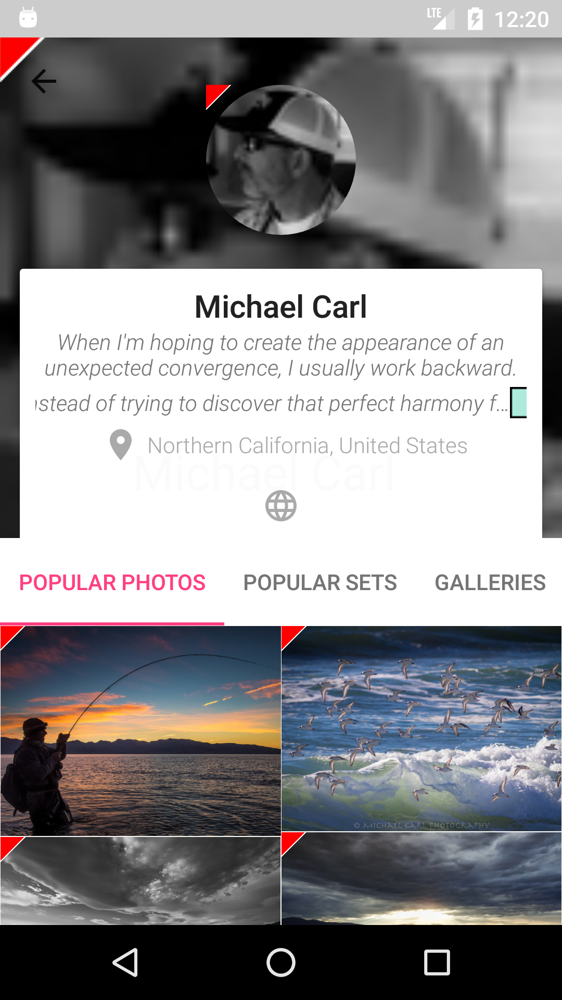
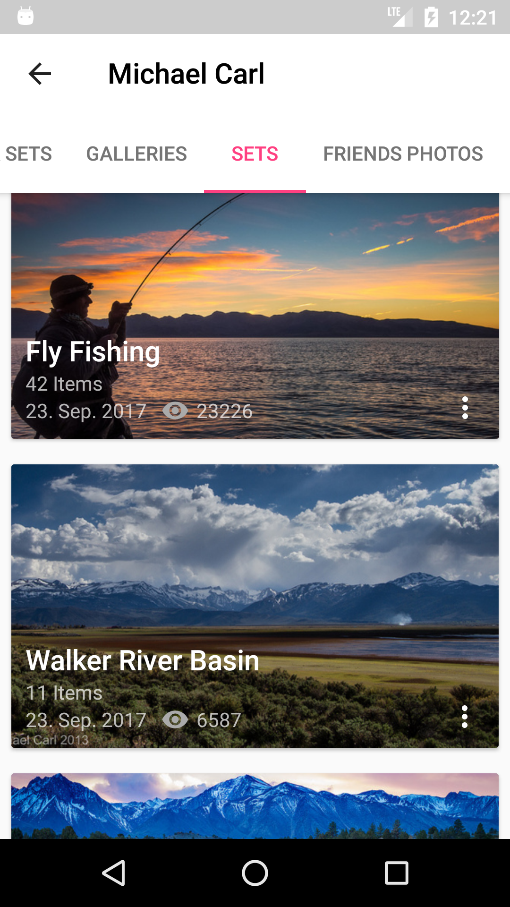
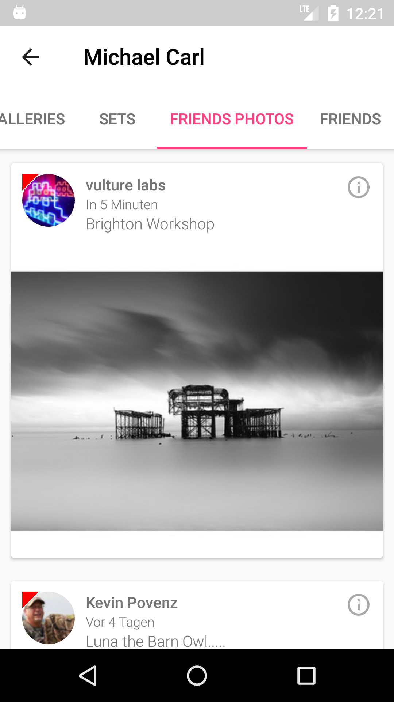

# TigerSpike demo application
by Dominik Tomczak

# Technologies used:
## Dagger 2
## Retrofi 2
## RxJava with Retrolambda
## Picasso for image loading
## ButterKnife 
## PhotoView library 
## Google Maps
## EventBus from GreenRobot

I haven't used any MVVN/MVP framework for this project although I am using such frameworks on a daily basis.
This code is based on my Android application available in Google Play:
https://play.google.com/store/apps/details?id=pl.cubesoft.photoviewer

Screen shots

